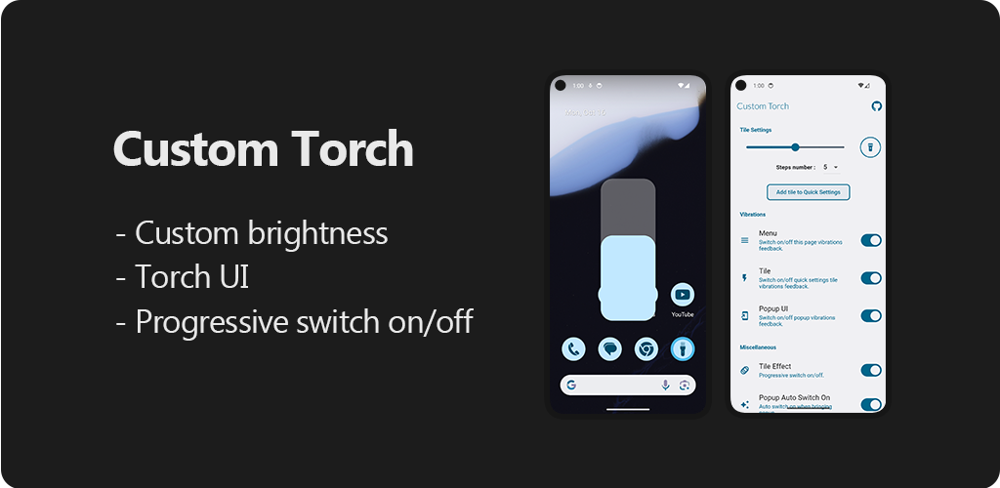

# Custom Torch

Custom tile with brightness control and a popup UI.

## Description

This app creates a tile in the quick settings so you can customize the brightness and access a slider over your apps.
Also with a smooth swith on/off transition.

## Supported devices

This app has been tested on Pixel 7 only. This app is compatible with Android 13+ devices using Camera2 torchStrenght API.

## Download

Soon.. You can compile the app with Flutter for now.

